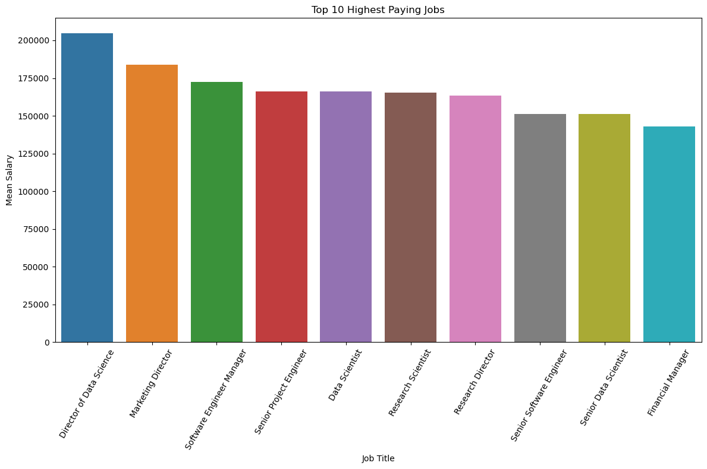
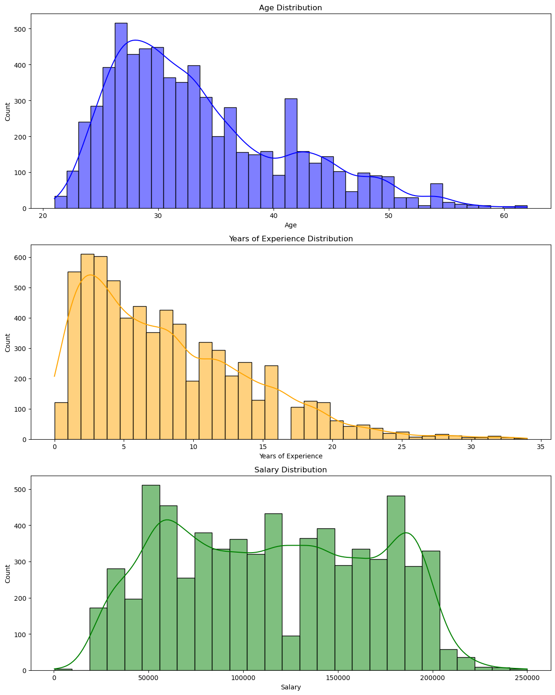
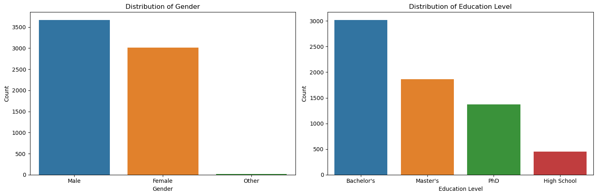
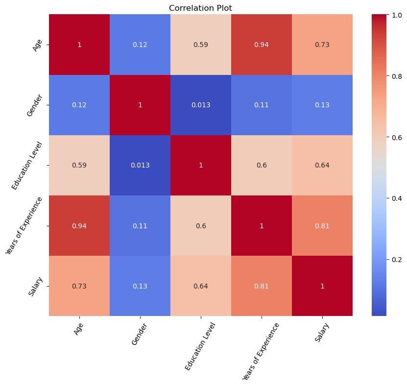
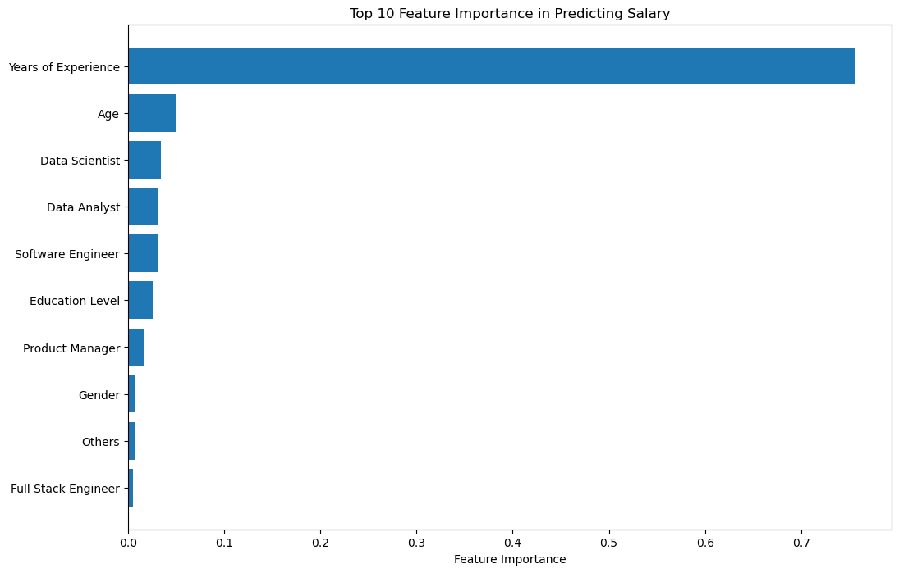

# Salary Prediction

## Introduction
This project aims to predict salaries based on various factors, such as age, gender, education level, job title, and years of experience. We have used a dataset containing 6704 rows and 6 columns to develop and evaluate our salary prediction model.

## Data Preprocessing

### Handling Missing Values
We checked for missing values in the dataset and removed rows with missing data, ensuring a clean dataset for modeling.

## Data Visualization

### Top 10 Highest Earning Professions

*A Bar plot depicting the highest paying job titles versus the mean salary.*

### Distribution of Continuous Variables

*This histogram shows the distribution of continuous variables in the dataset.*

### Distribution of Education and Gender

*A plot displaying the Education Level and Gender.*

### Correlation Heatmap

*A heatmap illustrating the correlation between different features.*

## Model Building and Evaluation

### Model Selection
We explored various machine learning algorithms, including Linear Regression, Decision Trees, and Random Forests, to build our salary prediction model. Hyperparameter tuning was performed using GridSearchCV to find the best model configuration.

### Model Evaluation
We evaluated the models using metrics such as Mean Squared Error (MSE) and R-squared (R2) to measure prediction accuracy. The best-performing model achieved an MSE of X and an R2 score of Y on the test set.

### Feature Importance

*A bar chart depicting the importance of different features in predicting salary.*

## Conclusion

In conclusion, our salary prediction model, trained on a well-preprocessed dataset, successfully predicts salaries based on various factors. This project demonstrates the importance of data preprocessing, feature engineering, and model selection in creating an accurate predictive model.

## Usage

To use our salary prediction model, you can follow these steps:

1. Clone this repository.
2. Install the required libraries listed in the `requirements.txt` file.
3. Run the provided Jupyter notebook or Python script to load the model and make predictions on new data.

